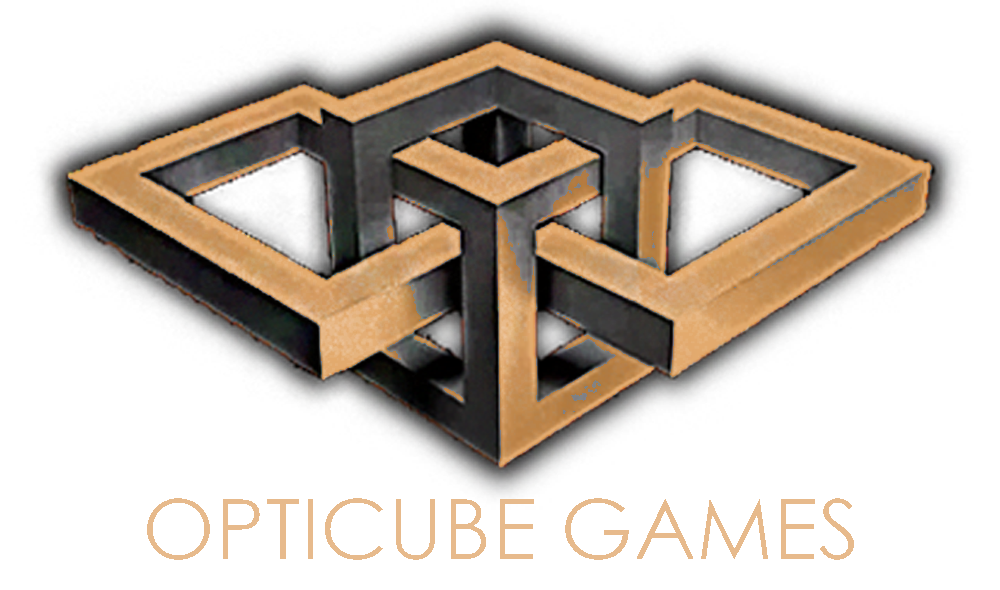

# OptiCube Website

Official static website for **OptiCube Games** and the **LUCKROT** project.

## Live Website

- Main website: [https://opticubestudio.com](https://opticubestudio.com)
- LUCKROT page: [https://opticubestudio.com/luckrot/](https://opticubestudio.com/luckrot/)
- LUCKROT Press Kit page: [https://opticubestudio.com/luckrot/press-kit/](https://opticubestudio.com/luckrot/press-kit/)
- Future Games page: [https://opticubestudio.com/future-games/](https://opticubestudio.com/future-games/)

## What This Project Includes

- Company landing page
- LUCKROT game page
- LUCKROT Press Kit with factsheet, description, trailer, screenshots, and media library
- Future Games page
- Shared header/footer loaded from partials
- Responsive layout for desktop, tablet, and mobile

## Planned Next Page

- `MEDIA DOWNLOAD` page
  - The `MEDIA DOWNLOAD` button exists on the Press Kit and is currently disabled.
  - It will be connected to a page where press/media assets can be downloaded.

## Screenshots

### Home / Branding



### LUCKROT Header


### Gameplay Screenshot


## Tech Stack

- HTML
- CSS
- Vanilla JavaScript

## Local Run

From the repository root:

```bash
python3 -m http.server 8080
```

Open:

```text
http://localhost:8080
```

## Project Structure

```text
.
├── index.html
├── luckrot/
│   ├── index.html
│   └── press-kit/
│       └── index.html
├── press-kit/
│   └── index.html
├── future-games/
│   └── index.html
├── luckrot.html
├── luckrot-presskit.html
├── presskit.html
├── future-games.html
├── styles.css
├── script.js
├── data/
│   └── media-library.json
├── partials/
│   ├── header.html
│   └── footer.html
└── images/
```

## Editing Guide

- Edit `index.html` for company homepage content.
- Edit `luckrot/index.html` for game page content and links.
- Edit `luckrot/press-kit/index.html` for LUCKROT press kit content.
- Edit `future-games/index.html` for Future Games page content.
- Edit `styles.css` for styling and responsive behavior.
- Edit `script.js` for interactions and partial loading logic.
- Edit `data/media-library.json` for Visual Library items on the LUCKROT Press Kit page.
- Keep `luckrot.html`, `luckrot-presskit.html`, `presskit.html`, `future-games.html`, and `press-kit/index.html` as legacy redirect files only.

## License

MIT. See `LICENSE`.
